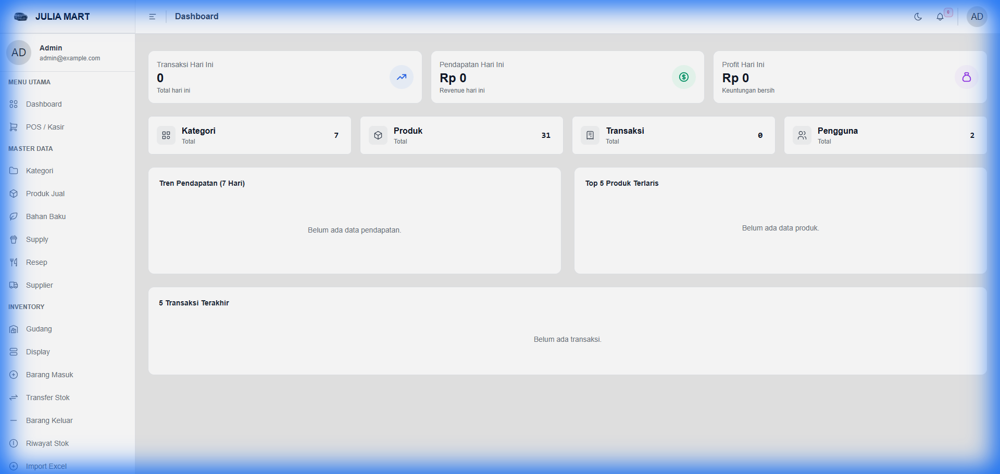
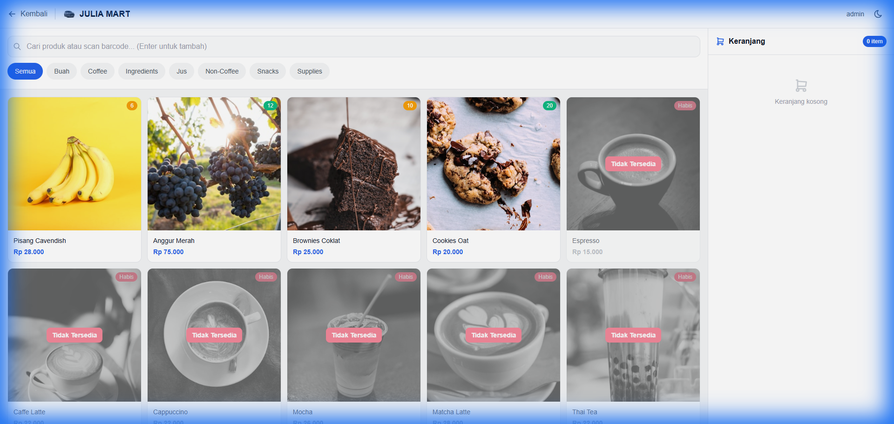
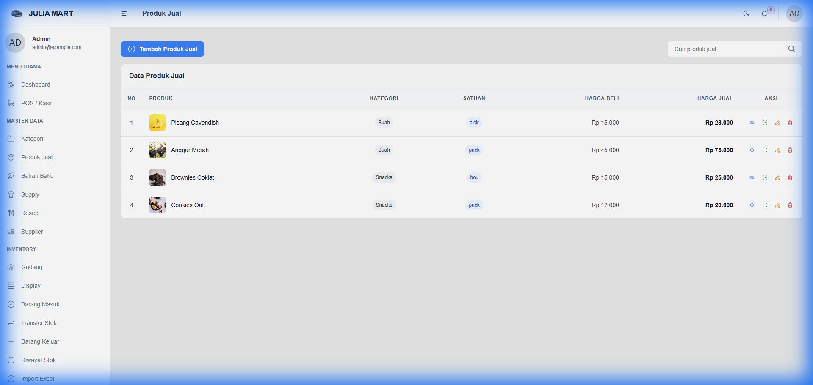
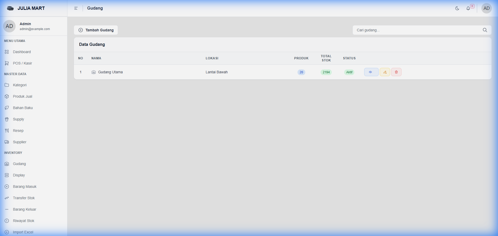
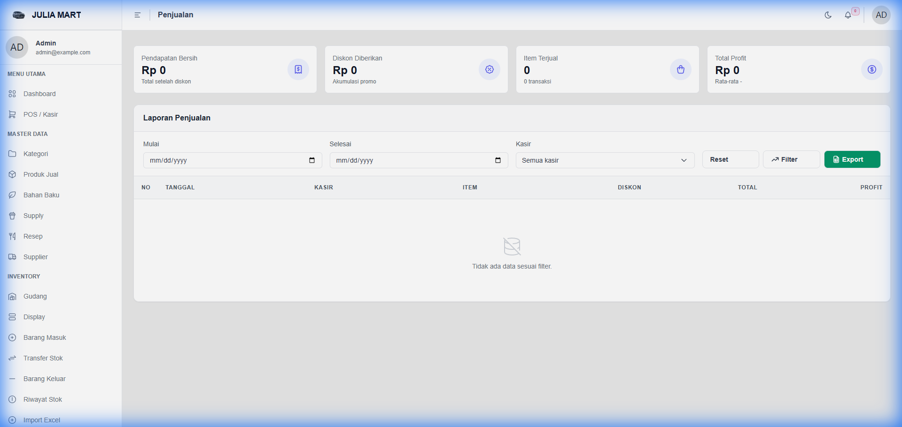
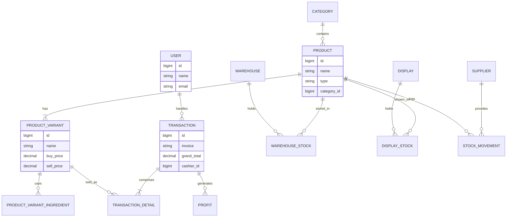
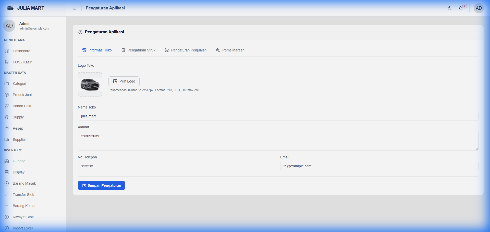

# Julia POS - Project Documentation

Julia POS adalah sistem Point of Sale (Kasir) berbasis web modern yang dirancang untuk efisiensi operasional toko atau kafe. Sistem ini mencakup manajemen inventaris yang kompleks (Gudang & Display), manajemen resep, hingga pelaporan keuangan real-time.

## 📑 Daftar Isi
1. [Fitur Utama](#-fitur-utama)
2. [Arsitektur Teknis](#-arsitektur-teknis)
3. [Skema Database](#-skema-database)
4. [Cetak Barcode Produk](#-cetak-barcode-produk)
5. [Inventaris & Penggudangan](#-inventaris--penggudangan)
6. [Laporan & Riwayat Stok](#-laporan--riwayat-stok)
7. [Panduan Penggunaan](#-panduan-penggunaan)

---

## 🚀 Fitur Utama

### 1. Dashboard & Statistik
Monitor performa toko secara real-time dengan metrik pendapatan, transaksi, kategori, dan tren penjualan dalam 7 hari terakhir.

### 2. Point of Sale (POS / Kasir)
Antarmuka kasir yang cepat dan responsif dengan fitur pencarian produk, scan barcode, filter kategori, dan manajemen keranjang belanja yang optimis (tanpa reload).

### 3. Manajemen Produk & Variasi
Mendukung berbagai jenis produk (Sellable, Recipe, Ingredient, Supply) dengan sistem variasi (seperti ukuran R, L, XL) yang masing-masing dapat memiliki harga dan resep tersendiri.

### 4. Cetak Barcode Produk
Memungkinkan pencetakan label barcode untuk setiap produk. Pengguna dapat menentukan jumlah label yang ingin dicetak sesuai kebutuhan stok.

### 5. Inventaris & Penggudangan
Sistem stok terbagi menjadi dua lokasi: **Gudang (Warehouse)** untuk stok besar dan **Display** untuk stok di area penjualan. Fitur transfer stok antar gudang dan display memastikan akurasi data.

### 5. Laporan & Riwayat Stok
Laporan penjualan lengkap dengan filter tanggal, pencarian, dan fitur ekspor ke Excel. Riwayat stok mencatat setiap pergerakan barang (In/Out/Transfer).

---

## 🛠 Arsitektur Teknis

Sistem ini dibangun menggunakan stack modern yang menjamin kecepatan dan kemudahan pemeliharaan:
- **Backend**: Laravel 11.x (PHP 8.2+)
- **Frontend**: React.js dengan Inertia.js (Single Page Application feel)
- **Database**: MySQL/PostgreSQL
- **Styling**: Vanilla CSS & Tailwind CSS (Custom components)
- **Komponen**: Shadcn UI inspired components, Tabler Icons

---

## 🗄 Skema Database

Sistem ini menggunakan struktur database relasional yang mendukung manajemen resep dan stok yang kompleks.

| Tabel | Deskripsi |
|-------|-----------|
| `users` | Autentikasi dan hak akses (Role/Permission). |
| `products` | Data master produk (SKU, Nama, Tipe). |
| `product_variants` | Variasi produk (Size/Varian) dengan harga beli/jual sendiri. |
| `product_variant_ingredients` | Resep (penggunaan bahan baku per varian). |
| `categories` | Pengelompokan produk. |
| `warehouses` | Lokasi penyimpanan stok utama. |
| `warehouse_stocks` | Saldo stok per produk di gudang tertentu. |
| `displays` | Lokasi stok di area POS. |
| `display_stocks` | Saldo stok per produk di area POS. |
| `transactions` | Header transaksi (ID, Total, Kasir). |
| `transaction_details` | Item baris transaksi (Produk, Qty, Harga). |
| `stock_movements` | Log audit setiap perubahan stok. |
| `profits` | Data keuntungan per transaksi. |
| `settings` | Konfigurasi sistem (Nama Toko, Logo). |

---

## 📊 ERD (Entity Relationship Diagram)

---

## ⚙️ Konfigurasi
Anda dapat mengatur informasi toko pada menu **Pengaturan**. Logo yang diunggah akan muncul secara otomatis di Struk, Sidebar, dan Halaman POS.

---
*Dokumentasi ini dihasilkan secara otomatis oleh sistem Julia POS.*
