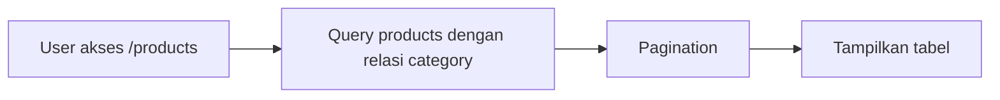
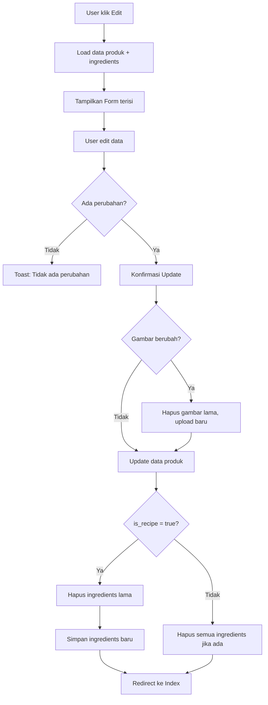
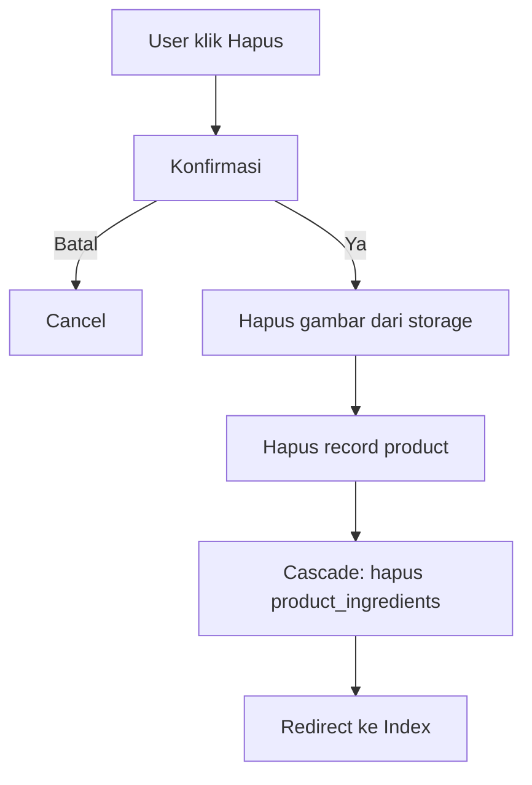
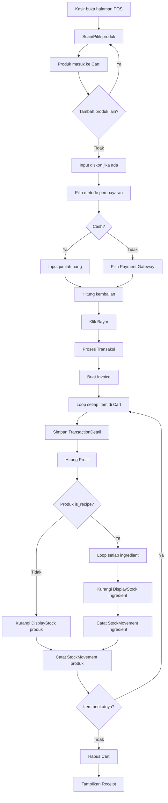

# Dokumentasi Fitur Product - POS Julia

Dokumentasi lengkap tentang fitur Product pada sistem Point of Sale.

---

## 1. Struktur Database

### Tabel `products`

| Kolom | Tipe | Deskripsi |
|-------|------|-----------|
| `id` | bigint | Primary key |
| `category_id` | FK | Kategori produk |
| `supplier_id` | FK (nullable) | Supplier produk |
| `image` | varchar | Nama file gambar |
| `barcode` | varchar (unique) | Kode barcode |
| `title` | varchar | Nama produk |
| `description` | text | Deskripsi |
| `buy_price` | bigint | **Harga Beli/Modal** |
| `sell_price` | bigint | **Harga Jual** |
| `unit` | varchar | Satuan (pcs, kg, liter) |
| `is_recipe` | boolean | Produk komposit/resep |
| `is_supply` | boolean | Alat pendukung |
| `is_ingredient` | boolean | Bahan baku |
| `created_at` | timestamp | Waktu dibuat |
| `updated_at` | timestamp | Waktu diupdate |

### Tabel `product_ingredients`

| Kolom | Tipe | Deskripsi |
|-------|------|-----------|
| `id` | bigint | Primary key |
| `product_id` | FK | Produk utama (resep) |
| `ingredient_id` | FK | Bahan/ingredient |
| `quantity` | decimal(10,3) | Jumlah bahan per 1 produk |

---

## 2. Jenis-Jenis Product

### 🛒 **Produk Reguler**
Produk standar yang dijual langsung.
- `is_recipe = false`
- `is_supply = false`
- `is_ingredient = false`

**Contoh:** Snack kemasan, minuman botol

### 🍳 **Produk Resep (is_recipe = true)**
Produk komposit yang dibuat dari bahan-bahan lain.

**Contoh:** Es Kopi Susu
```
Es Kopi Susu (1 porsi)
├── Kopi Espresso: 50ml
├── Susu: 100ml
├── Gula: 10g
└── Es Batu: 100g
```

**Penting:** Saat produk resep terjual, stok SEMUA ingredient akan dikurangi otomatis.

### 🧪 **Bahan Baku (is_ingredient = true)**
Produk yang bisa digunakan sebagai bahan di resep lain.

**Contoh:** Susu, Kopi, Gula, Tepung

### 🥤 **Alat Pendukung (is_supply = true)**
Barang pendukung yang tidak dijual langsung dan **stoknya dipotong dari Warehouse** (bukan Display) saat transaksi.

**Contoh:** Cup plastik, Sedotan, Kantong belanja

> ⚠️ **Catatan Penting:** Saat produk resep terjual, supply akan dipotong dari warehouse pertama yang memiliki stok mencukupi. Pastikan stok supply selalu ada di warehouse.

---

## 3. Relasi Product

```
Product
│
├──→ Category (belongsTo)
│    Setiap produk punya 1 kategori
│
├──→ Supplier (belongsTo, nullable)
│    Produk bisa punya supplier atau tidak
│
├──→ WarehouseStock (hasMany)
│    Stok di berbagai gudang
│
├──→ DisplayStock (hasMany)
│    Stok di berbagai etalase/toko
│
├──→ StockMovement (hasMany)
│    Riwayat pergerakan stok
│
├──→ ProductIngredient (hasMany) - sebagai "parent recipe"
│    Bahan-bahan yang dibutuhkan (jika is_recipe = true)
│
└──→ ProductIngredient (hasMany) - sebagai "ingredient"
     Digunakan oleh resep lain (jika is_ingredient = true)
```

---

## 4. Alur CRUD Product

### 4.1 CREATE - Tambah Produk Baru

```mermaid
flowchart TD
    A[User klik "Tambah Produk"] --> B[Isi Form]
    B --> C{Validasi Input}
    C -->|Error| D[Tampilkan Error]
    D --> B
    C -->|Valid| E[Upload Gambar ke storage/products/]
    E --> F[Simpan ke tabel products]
    F --> G{is_recipe = true?}
    G -->|Ya| H[Simpan ingredients ke product_ingredients]
    G -->|Tidak| I[Redirect ke Index]
    H --> I
```

**File terkait:**
- Controller: `app/Http/Controllers/Apps/ProductController.php` → `store()`
- View: `resources/js/Pages/Dashboard/Products/Create.jsx`

### 4.2 READ - Lihat Daftar Produk



**Fitur:**
- Pencarian berdasarkan nama
- Pagination (default 10 per halaman)
- Tampilkan gambar, barcode, nama, kategori, harga

### 4.3 UPDATE - Edit Produk



**File terkait:**
- Controller: `ProductController.php` → `edit()`, `update()`
- View: `resources/js/Pages/Dashboard/Products/Edit.jsx`

### 4.4 DELETE - Hapus Produk



---

## 5. Alur Stok Product

### 5.1 Struktur Lokasi Stok

```
                    ┌─────────────────┐
                    │    SUPPLIER     │
                    └────────┬────────┘
                             │ Stock In (Pembelian)
                             ▼
                    ┌─────────────────┐
                    │    WAREHOUSE    │ ← Gudang penyimpanan
                    └────────┬────────┘
                             │ Transfer
                             ▼
                    ┌─────────────────┐
                    │     DISPLAY     │ ← Etalase/Toko
                    └────────┬────────┘
                             │ Penjualan
                             ▼
                    ┌─────────────────┐
                    │   TRANSACTION   │ ← Transaksi POS
                    └─────────────────┘
```

### 5.2 Pergerakan Stok (StockMovement)

| Tipe | Dari | Ke | Deskripsi |
|------|------|----|-----------|
| Stock In | Supplier | Warehouse | Pembelian barang |
| Transfer | Warehouse | Display | Kirim ke toko |
| Transfer | Warehouse | Warehouse | Pindah gudang |
| Sale | Display | Transaction | Penjualan |
| Stock Out | Display | - | Barang rusak/expired |

---

## 6. Alur Transaksi & Pemotongan Stok

### 6.1 Alur Lengkap Transaksi



### 6.2 Contoh Kasus: Penjualan Produk Resep

**Skenario:** Customer beli 2 Es Kopi Susu

**Data Resep:**
| Ingredient | Qty per porsi |
|------------|---------------|
| Kopi Espresso | 50ml |
| Susu | 100ml |
| Gula | 10g |

**Stok Sebelum:**
| Produk | Stok Display |
|--------|--------------|
| Kopi Espresso | 500ml |
| Susu | 1000ml |
| Gula | 200g |

**Proses:**
1. Es Kopi Susu × 2 ditambah ke cart
2. Kasir proses pembayaran
3. Sistem mendeteksi `is_recipe = true`
4. Kurangi stok per ingredient:
   - Kopi: 50ml × 2 = 100ml
   - Susu: 100ml × 2 = 200ml
   - Gula: 10g × 2 = 20g

**Stok Sesudah:**
| Produk | Stok Display |
|--------|--------------|
| Kopi Espresso | 400ml |
| Susu | 800ml |
| Gula | 180g |

---

## 7. Perhitungan Profit

### Formula Dasar

```
Profit = (Harga Jual × Qty) - (Harga Beli × Qty)
```

### Contoh Perhitungan

| Produk | Buy Price | Sell Price | Qty | Total Buy | Total Sell | Profit |
|--------|-----------|------------|-----|-----------|------------|--------|
| Es Kopi | Rp 8.000 | Rp 15.000 | 2 | Rp 16.000 | Rp 30.000 | Rp 14.000 |
| Snack | Rp 5.000 | Rp 7.000 | 3 | Rp 15.000 | Rp 21.000 | Rp 6.000 |
| **Total** | | | | **Rp 31.000** | **Rp 51.000** | **Rp 20.000** |

### Kode Perhitungan (TransactionController.php)

```php
foreach ($carts as $cart) {
    // Hitung profit per item
    $total_buy_price = $cart->product->buy_price * $cart->qty;
    $total_sell_price = $cart->product->sell_price * $cart->qty;
    $profits = $total_sell_price - $total_buy_price;

    // Simpan ke tabel profits
    $transaction->profits()->create([
        'transaction_id' => $transaction->id,
        'total' => $profits,
    ]);
}
```

> ⚠️ **Catatan:** Untuk produk resep, profit dihitung dari `buy_price` produk jadi (Es Kopi Susu), BUKAN dari total harga ingredient. Pastikan `buy_price` produk resep mencerminkan biaya bahan + operasional.

---

## 8. File-File Terkait

### Backend (Laravel)

| File | Fungsi |
|------|--------|
| `app/Models/Product.php` | Model dengan relasi dan accessor |
| `app/Models/ProductIngredient.php` | Model pivot untuk resep |
| `app/Http/Controllers/Apps/ProductController.php` | CRUD operations |
| `app/Http/Controllers/Apps/TransactionController.php` | Pemotongan stok saat transaksi |
| `database/migrations/2024_01_01_000002_create_products_table.php` | Schema database |

### Frontend (React/Inertia)

| File | Fungsi |
|------|--------|
| `resources/js/Pages/Dashboard/Products/Index.jsx` | Daftar produk |
| `resources/js/Pages/Dashboard/Products/Create.jsx` | Form tambah produk |
| `resources/js/Pages/Dashboard/Products/Edit.jsx` | Form edit produk |
| `resources/js/Pages/Dashboard/POS/Index.jsx` | Halaman kasir/POS |

---

## 9. Tips & Best Practices

### Membuat Produk Resep

1. Buat dulu semua ingredient sebagai produk dengan `is_ingredient = true`
2. Buat produk resep dengan `is_recipe = true`
3. Tambahkan ingredient dengan quantity yang benar
4. Set `buy_price` = estimasi biaya bahan per porsi
5. Set `sell_price` = harga jual ke customer

### Manajemen Stok

1. Stock In selalu ke **Warehouse** dulu
2. Transfer ke **Display** untuk dijual
3. Transaksi mengurangi stok dari **Display**
4. Monitor produk dengan stok rendah di Dashboard

### Perhitungan Modal yang Akurat

Untuk produk resep, hitung manual:
```
buy_price Es Kopi = (Kopi × harga) + (Susu × harga) + (Gula × harga) + overhead
```

---

*Dokumentasi ini dibuat otomatis. Terakhir diupdate: Desember 2024*
