# Alur Project POS Julia

Dokumentasi lengkap tentang arsitektur dan alur sistem Point of Sale (POS) Julia.

---

## 📋 Overview Project

**POS Julia** adalah sistem kasir berbasis web yang dibangun dengan:
- **Backend**: Laravel (PHP)
- **Frontend**: React + Inertia.js
- **Database**: MySQL/PostgreSQL
- **Styling**: Tailwind CSS

---

## 🏗️ Arsitektur Sistem

```
┌─────────────────────────────────────────────────────────────────┐
│                        FRONTEND (React)                         │
│  ┌─────────────────────────────────────────────────────────────┐│
│  │ Dashboard │ POS │ Products │ Stock │ Reports │ Settings    ││
│  └─────────────────────────────────────────────────────────────┘│
│                           ↕ Inertia.js                          │
├─────────────────────────────────────────────────────────────────┤
│                        BACKEND (Laravel)                        │
│  ┌─────────────────────────────────────────────────────────────┐│
│  │     Controllers  │  Models  │  Middleware  │  Routes       ││
│  └─────────────────────────────────────────────────────────────┘│
│                           ↕                                     │
├─────────────────────────────────────────────────────────────────┤
│                        DATABASE                                  │
│  ┌─────────────────────────────────────────────────────────────┐│
│  │ users│products│categories│warehouses│displays│transactions ││
│  └─────────────────────────────────────────────────────────────┘│
└─────────────────────────────────────────────────────────────────┘
```

---

## 🗂️ Struktur Folder

```
pos-julia/
├── app/
│   ├── Http/Controllers/
│   │   ├── Apps/                  # Controller fitur utama
│   │   │   ├── CategoryController.php
│   │   │   ├── ProductController.php
│   │   │   ├── POSController.php
│   │   │   ├── TransactionController.php
│   │   │   ├── StockMovementController.php
│   │   │   ├── WarehouseController.php
│   │   │   ├── DisplayController.php
│   │   │   ├── SupplierController.php
│   │   │   └── PaymentSettingController.php
│   │   ├── Reports/               # Controller laporan
│   │   │   ├── SalesReportController.php
│   │   │   └── ProfitReportController.php
│   │   ├── DashboardController.php
│   │   ├── UserController.php
│   │   ├── RoleController.php
│   │   └── PermissionController.php
│   └── Models/                    # Model database
│       ├── User.php
│       ├── Product.php
│       ├── ProductVariant.php
│       ├── ProductIngredient.php
│       ├── Category.php
│       ├── Supplier.php
│       ├── Warehouse.php
│       ├── WarehouseStock.php
│       ├── Display.php
│       ├── DisplayStock.php
│       ├── StockMovement.php
│       ├── Cart.php
│       ├── Transaction.php
│       ├── TransactionDetail.php
│       ├── Profit.php
│       └── PaymentSetting.php
├── resources/js/
│   ├── Pages/Dashboard/           # Halaman React
│   │   ├── Index.jsx              # Dashboard utama
│   │   ├── POS/                   # Halaman kasir
│   │   ├── Products/              # CRUD produk
│   │   ├── Categories/            # CRUD kategori
│   │   ├── Suppliers/             # CRUD supplier
│   │   ├── Warehouses/            # CRUD gudang
│   │   ├── Displays/              # CRUD etalase
│   │   ├── StockMovements/        # Manajemen stok
│   │   ├── Transactions/          # Histori transaksi
│   │   ├── Reports/               # Laporan
│   │   ├── Users/                 # Manajemen user
│   │   ├── Roles/                 # Manajemen role
│   │   ├── Permissions/           # Permissions
│   │   └── Settings/              # Pengaturan
│   └── Components/                # Komponen reusable
├── database/migrations/           # Schema database
└── routes/web.php                 # Definisi routing
```

---

## 🔄 Alur Fitur Utama

### 1. Alur Autentikasi

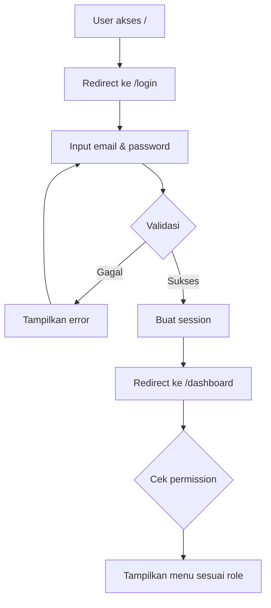

---

### 2. Alur Master Data

#### 2.1 Kategori (Categories)

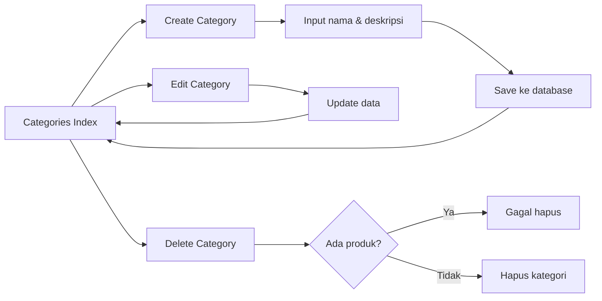

**Route**: `/dashboard/categories`

---

#### 2.2 Produk (Products)

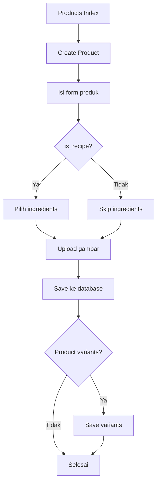

**Jenis Produk**:
| Tipe | Keterangan |
|------|------------|
| **Reguler** | Produk standar dijual langsung |
| **Recipe** | Produk komposit dari bahan lain |
| **Ingredient** | Bahan baku untuk resep |
| **Supply** | Alat pendukung (cup, sedotan) |

**Route**: `/dashboard/products`

---

#### 2.3 Supplier

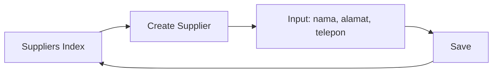

**Route**: `/dashboard/suppliers`

---

### 3. Alur Manajemen Stok

#### 3.1 Struktur Lokasi Stok

```
         SUPPLIER
            │
            │ Stock In
            ▼
       ┌─────────┐
       │WAREHOUSE│ ← Gudang utama
       └────┬────┘
            │ Transfer
            ▼
       ┌─────────┐
       │ DISPLAY │ ← Etalase/Toko
       └────┬────┘
            │ Sale
            ▼
       TRANSACTION
```

#### 3.2 Jenis Pergerakan Stok

| Tipe | Dari | Ke | Deskripsi |
|------|------|----|-----------| 
| **Stock In** | Supplier | Warehouse | Pembelian barang |
| **Transfer** | Warehouse | Display | Kirim ke toko |
| **Transfer** | Warehouse | Warehouse | Pindah gudang |
| **Sale** | Display | - | Penjualan via POS |
| **Stock Out** | Display | - | Barang rusak/expired |

#### 3.3 Alur Stock In

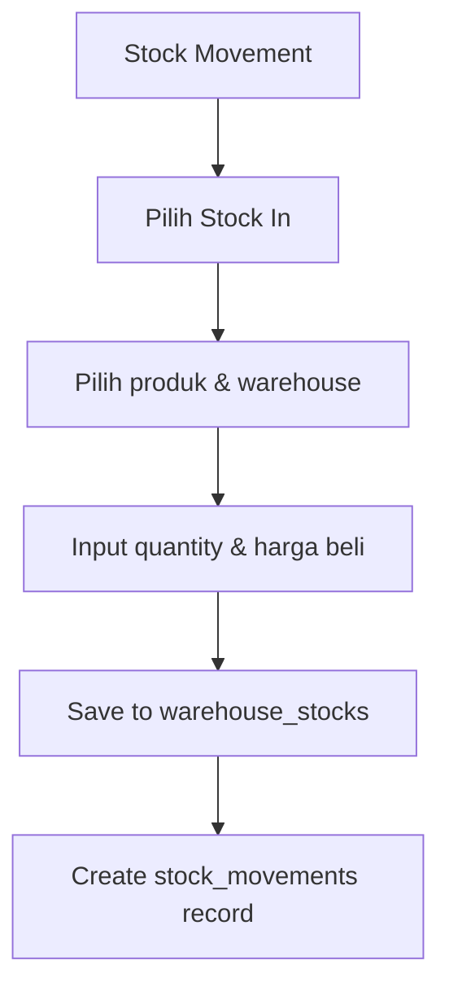

**Route**: `/dashboard/stock-movements/create`

#### 3.4 Alur Transfer

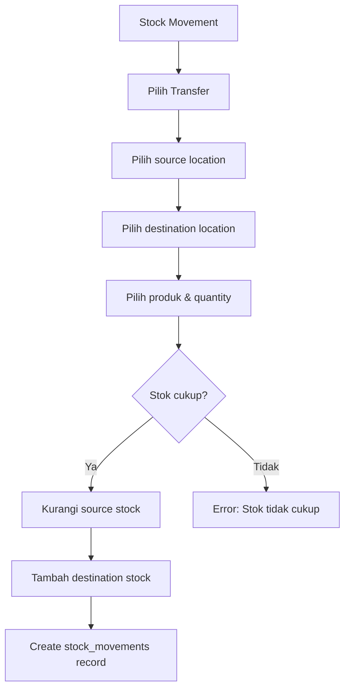

**Route**: `/dashboard/stock-movements/transfer`

#### 3.5 Bulk Import Stock

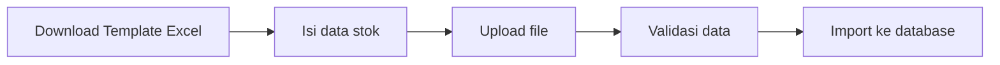

**Route**: `/dashboard/stock-movements/bulk-import`

---

### 4. Alur Point of Sale (POS)

#### 4.1 Alur Lengkap Transaksi

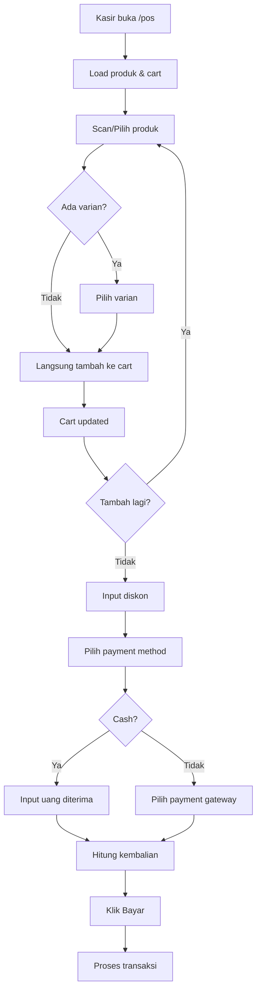

#### 4.2 Proses Backend Transaksi

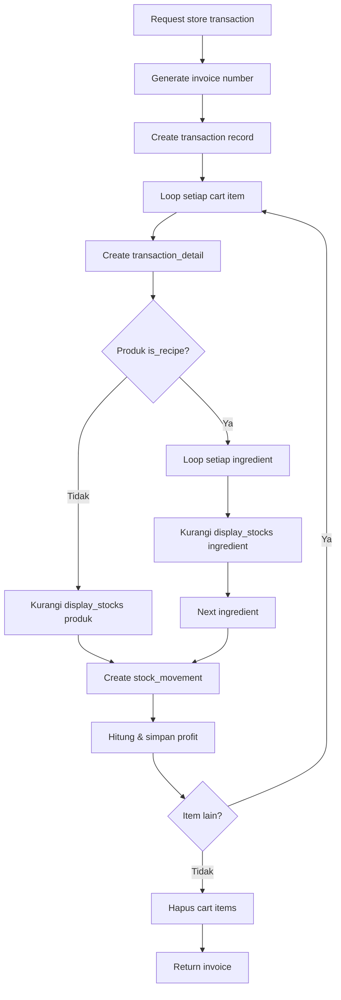

**Routes**:
- `GET /dashboard/pos` - Halaman POS
- `POST /dashboard/pos/addToCart` - Tambah ke cart
- `DELETE /dashboard/pos/{cart_id}/destroyCart` - Hapus item cart
- `PATCH /dashboard/pos/{cart_id}/updateCart` - Update quantity
- `POST /dashboard/pos/store` - Proses transaksi

---

### 5. Alur Laporan (Reports)

#### 5.1 Sales Report

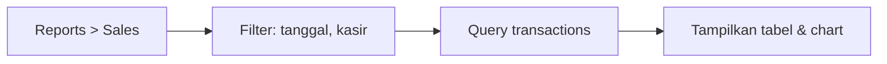

**Data ditampilkan**:
- Total transaksi
- Total penjualan
- Breakdown per produk
- Trend penjualan

**Route**: `/dashboard/reports/sales`

#### 5.2 Profit Report

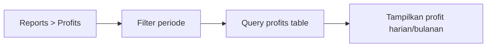

**Route**: `/dashboard/reports/profits`

---

### 6. Alur User Management

#### 6.1 Hierarki Akses

```
PERMISSIONS (aksi dasar)
    ↓
ROLES (kumpulan permissions)
    ↓
USERS (memiliki roles)
```

#### 6.2 Contoh Permission

| Permission | Deskripsi |
|------------|-----------|
| `products-access` | Lihat daftar produk |
| `products-create` | Tambah produk baru |
| `products-edit` | Edit produk |
| `products-delete` | Hapus produk |
| `transactions-access` | Akses POS & transaksi |
| `reports-access` | Lihat laporan |

---

## 📊 Entity Relationship Diagram

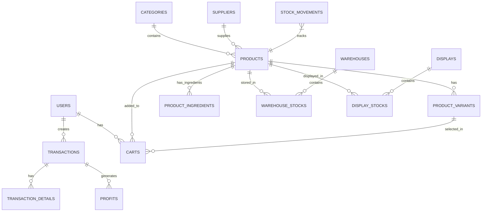

---

## 🔐 Middleware & Authorization

Semua route dilindungi oleh:

1. **`auth`** - Memastikan user sudah login
2. **`permission:xxx`** - Memastikan user punya permission tertentu

Contoh:
```php
Route::get('/products', [ProductController::class, 'index'])
    ->middleware('permission:products-access');
```

---

## 📱 Navigasi Menu

```
Dashboard
├── 📊 Dashboard (overview)
├── 🛒 POS (kasir)
├── 📦 Master Data
│   ├── Categories
│   ├── Products
│   └── Suppliers
├── 📍 Inventory
│   ├── Warehouses
│   ├── Displays
│   └── Stock Movements
├── 💰 Transactions
│   └── History
├── 📈 Reports
│   ├── Sales Report
│   └── Profit Report
├── 👥 User Management
│   ├── Users
│   ├── Roles
│   └── Permissions
└── ⚙️ Settings
    └── Payment Settings
```

---

## 🔧 Konfigurasi Environment

File `.env` yang perlu dikonfigurasi:

```env
APP_NAME=POS-Julia
APP_URL=http://localhost:8000

DB_CONNECTION=mysql
DB_HOST=127.0.0.1
DB_PORT=3306
DB_DATABASE=pos_julia
DB_USERNAME=root
DB_PASSWORD=

# Payment Settings (jika ada)
PAYMENT_GATEWAY_KEY=xxx
```

---

## 🚀 Menjalankan Project

### Development

```bash
# Install dependencies
composer install
npm install

# Setup database
php artisan migrate
php artisan db:seed

# Run servers
php artisan serve    # Backend: http://localhost:8000
npm run dev          # Frontend Vite
```

### Production

```bash
npm run build
php artisan optimize
```

---

## 📝 Catatan Penting

1. **Stok produk resep**: Saat dijual, stok SEMUA ingredient akan dikurangi otomatis
2. **Supply**: Dipotong dari warehouse pertama yang memiliki stok cukup
3. **Profit**: Dihitung dari `sell_price - buy_price` per item
4. **Varian produk**: Nama varian akan disimpan di transaction_detail untuk riwayat

---

*Dokumentasi dibuat: Desember 2025*
